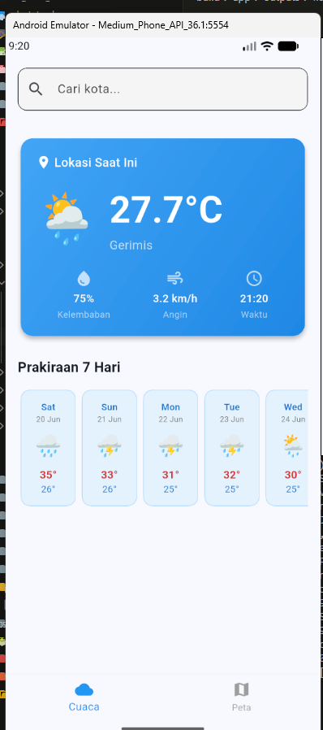
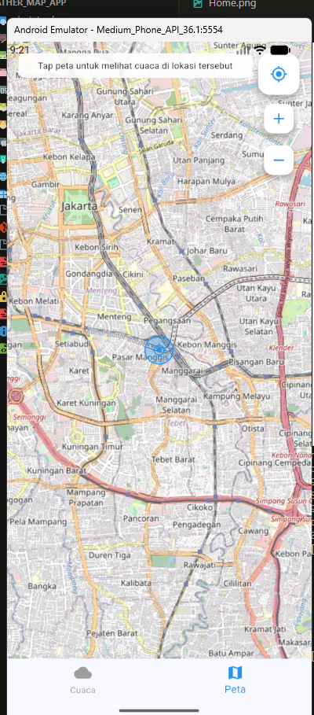

# Laporan Praktikum: Aplikasi Cuaca & Peta Berbasis Mobile

**Mata Kuliah**: Perangkat Bergerak  
**Semester**: 4 (Genap 2025/2026)  
**Versi Aplikasi**: 1.0.0  
**Framework**: Flutter 3.41.4 | Dart 3.11.1  

---

## Daftar Isi

1. [Tujuan Praktikum](#1-tujuan-praktikum)
2. [Deskripsi Aplikasi](#2-deskripsi-aplikasi)
3. [Fitur Aplikasi](#3-fitur-aplikasi)
4. [Screenshot Aplikasi](#4-screenshot-aplikasi)
5. [Arsitektur & Desain](#5-arsitektur--desain)
6. [Teknologi & Dependencies](#6-teknologi--dependencies)
7. [Sumber Data API](#7-sumber-data-api)
8. [Prasyarat Lingkungan](#8-prasyarat-lingkungan)
9. [Langkah-langkah Instalasi & Menjalankan Aplikasi](#9-langkah-langkah-instalasi--menjalankan-aplikasi)
10. [Panduan Penggunaan](#10-panduan-penggunaan)
11. [Struktur Direktori Project](#11-struktur-direktori-project)
12. [Penjelasan Kode](#12-penjelasan-kode)
13. [Konfigurasi Android](#13-konfigurasi-android)
14. [Troubleshooting](#14-troubleshooting)
15. [Kesimpulan](#15-kesimpulan)

---

## 1. Tujuan Praktikum

- Mengimplementasikan aplikasi mobile menggunakan framework **Flutter** untuk platform Android.
- Mengintegrasikan **API publik** (Open-Meteo) untuk pengambilan data cuaca secara real-time tanpa memerlukan API key.
- Mengimplementasikan **peta interaktif** menggunakan OpenStreetMap dan library `flutter_map`.
- Memanfaatkan **geolocator** untuk mendeteksi lokasi user berdasarkan GPS perangkat.
- Menerapkan konsep **StatefulWidget**, **async/await**, dan **REST API consumption** dalam pengembangan aplikasi mobile.

---

## 2. Deskripsi Aplikasi

**Cuaca & Peta** adalah aplikasi mobile cross-platform yang dibangun dengan Flutter, dirancang untuk menampilkan informasi cuaca real-time dan peta interaktif dalam satu antarmuka yang intuitif. Aplikasi ini memanfaatkan dua sumber data utama:

- **Open-Meteo API** -- layanan data cuaca gratis dan terbuka yang menyediakan informasi cuaca saat ini, prakiraan harian, serta geocoding (pencarian lokasi berdasarkan nama kota).
- **OpenStreetMap** -- proyek pemetaan kolaboratif open-source yang menyediakan tile peta gratis untuk ditampilkan dalam aplikasi.

Keunggulan utama aplikasi ini adalah **tidak memerlukan API key berbayar** sama sekali, sehingga mudah untuk di-clone, dibangun, dan dijalankan oleh siapa saja.

---

## 3. Fitur Aplikasi

### 3.1 Tab Cuaca (Weather)

| No | Fitur | Deskripsi |
|----|-------|-----------|
| 1 | Deteksi Lokasi Otomatis | Aplikasi mendeteksi lokasi user via GPS saat pertama kali dibuka. Jika GPS tidak tersedia, fallback ke koordinat Jakarta. |
| 2 | Pencarian Kota | Search bar dengan autocomplete yang terhubung ke Open-Meteo Geocoding API, mendukung pencarian kota di seluruh dunia. |
| 3 | Cuaca Saat Ini | Menampilkan suhu (°C), kelembaban (%), kecepatan angin (km/h), kondisi cuaca (Cerah, Hujan, Berawan, dll), dan waktu pengambilan data. |
| 4 | Prakiraan 7 Hari | Daftar prakiraan cuaca horizontal selama 7 hari ke depan, mencakup suhu maksimum, suhu minimum, dan ikon kondisi cuaca. |
| 5 | Pull to Refresh | User dapat menarik layar ke bawah untuk memperbarui data cuaca secara manual. |
| 6 | Error Handling | Tampilan pesan error yang informatif beserta tombol "Coba Lagi" jika terjadi kegagalan pengambilan data. |

### 3.2 Tab Peta (Map)

| No | Fitur | Deskripsi |
|----|-------|-----------|
| 1 | Peta Interaktif | Peta OpenStreetMap yang bisa di-zoom, digeser, dan dijelajahi secara bebas. |
| 2 | Tap untuk Cuaca | Tap di titik mana saja pada peta untuk mengambil dan menampilkan data cuaca di lokasi tersebut. |
| 3 | Marker Lokasi Saat Ini | Marker biru transparan menunjukkan posisi user saat ini berdasarkan GPS. |
| 4 | Marker Lokasi Terpilih | Marker merah muncul di titik yang di-tap oleh user. |
| 5 | Bottom Sheet Cuaca | Panel bawah yang muncul setelah tap, menampilkan suhu, kondisi, kelembaban, dan kecepatan angin. |
| 6 | Kontrol Peta | Tombol floating untuk kembali ke lokasi user, zoom in, dan zoom out. |
| 7 | Instruksi User | Banner di atas peta yang memberi petunjuk: "Tap peta untuk melihat cuaca di lokasi tersebut". |

---

## 4. Screenshot Aplikasi

### 4.1 Tab Cuaca -- Tampilan Cuaca Saat Ini & Prakiraan 7 Hari

<p align="center">
  
</p>

**Keterangan screenshot:**
- Search bar "Cari kota..." untuk pencarian lokasi.
- Card cuaca menampilkan lokasi "Lokasi Saat Ini" dengan suhu **27.7°C**, kondisi **Gerimis**, kelembaban **75%**, kecepatan angin **3.2 km/h**, dan waktu **21:20**.
- Prakiraan 7 hari ditampilkan dalam card horizontal (Sabtu s/d Rabu) dengan ikon cuaca dan rentang suhu max/min.
- Bottom navigation menunjukkan tab **Cuaca** aktif (ikon biru).

### 4.2 Tab Peta -- Peta Interaktif OpenStreetMap

<p align="center">
  
</p>

**Keterangan screenshot:**
- Peta menampilkan wilayah Jakarta dengan nama-nama daerah (Menteng, Kebon Sirih, Pasar Minggu, dll).
- Marker biru transparan di tengah peta menunjukkan lokasi user saat ini.
- Tombol kontrol di kanan atas: lokasi (bulat biru), zoom in (+), zoom out (-).
- Banner instruksi di atas: "Tap peta untuk melihat cuaca di lokasi tersebut".
- Bottom navigation menunjukkan tab **Peta** aktif (ikon biru).

---

## 5. Arsitektur & Desain

Aplikasi ini menggunakan pola arsitektur **Service-Based Architecture** dengan pemisahan layer yang jelas:

```
┌─────────────────────────────────────────────────────┐
│                    UI Layer (Screens)                │
│   HomeScreen → WeatherScreen / MapScreen             │
├─────────────────────────────────────────────────────┤
│                 Widget Layer (Components)            │
│   WeatherCard, ForecastItem                          │
├─────────────────────────────────────────────────────┤
│                  Service Layer (Logic)               │
│   WeatherService, LocationService                    │
├─────────────────────────────────────────────────────┤
│                   Model Layer (Data)                 │
│   WeatherData, ForecastData, LocationData            │
├─────────────────────────────────────────────────────┤
│                  External APIs                       │
│   Open-Meteo API, OpenStreetMap Tiles                │
└─────────────────────────────────────────────────────┘
```

**Prinsip yang diterapkan:**
- **Separation of Concerns** -- Model, Service, Screen, dan Widget dipisah ke file masing-masing.
- **StatefulWidget** -- Setiap screen mengelola state-nya sendiri (loading, error, data).
- **Async/Await** -- Semua pemanggilan API menggunakan pattern asynchronous.
- **Error Handling** -- Try-catch di setiap layer dengan fallback dan pesan error yang informatif.
- **Material Design 3** -- Menggunakan color scheme modern dengan seed color biru.

---

## 6. Teknologi & Dependencies

### 6.1 Framework Utama

| Teknologi | Versi | Keterangan |
|-----------|-------|------------|
| **Flutter** | 3.41.4 (Stable) | Framework UI cross-platform dari Google |
| **Dart** | 3.11.1 | Bahasa pemrograman yang digunakan Flutter |
| **Material Design 3** | - | Design system modern untuk UI/UX |

### 6.2 Dependencies (dari pubspec.yaml)

| Package | Versi | Fungsi |
|---------|-------|--------|
| `http` | ^1.6.0 | HTTP client untuk melakukan GET request ke Open-Meteo API dan Geocoding API |
| `flutter_map` | ^8.3.0 | Widget peta interaktif yang mendukung tile OpenStreetMap, marker, dan event tap |
| `latlong2` | ^0.9.1 | Library untuk manipulasi koordinat geografis (latitude & longitude) |
| `geolocator` | ^14.0.3 | Plugin untuk mengakses layanan lokasi GPS perangkat, termasuk permission handling |
| `intl` | ^0.20.2 | Library internasionalisasi untuk format tanggal dan waktu (prakiraan harian) |
| `cupertino_icons` | ^1.0.8 | Ikon gaya iOS untuk kompatibilitas visual |

### 6.3 Dev Dependencies

| Package | Versi | Fungsi |
|---------|-------|--------|
| `flutter_test` | SDK | Framework unit testing bawaan Flutter |
| `flutter_lints` | ^6.0.0 | Aturan lint untuk mendorong praktik coding yang baik |

---

## 7. Sumber Data API

### 7.1 Open-Meteo Weather Forecast API

- **Base URL**: `https://api.open-meteo.com/v1/forecast`
- **Metode**: GET
- **Autentikasi**: Tidak diperlukan (gratis, tanpa API key)
- **Parameter yang digunakan**:

| Parameter | Nilai | Keterangan |
|-----------|-------|------------|
| `latitude` | Koordinat lintang | Lokasi yang akan diambil cuacanya |
| `longitude` | Koordinat bujur | Lokasi yang akan diambil cuacanya |
| `current` | `temperature_2m,relative_humidity_2m,weather_code,wind_speed_10m` | Variabel cuaca saat ini |
| `daily` | `weather_code,temperature_2m_max,temperature_2m_min` | Variabel prakiraan harian |
| `timezone` | `auto` | Zona waktu otomatis berdasarkan lokasi |
| `forecast_days` | `7` | Jumlah hari prakiraan |

**Weather Code Mapping** (kode cuaca ke deskripsi):

| Kode | Deskripsi | Ikon |
|------|-----------|------|
| 0 | Cerah | ☀️ |
| 1 | Cerah Berawan | 🌤️ |
| 2 | Berawan Sebagian | 🌤️ |
| 3 | Berawan | ☁️ |
| 45, 48 | Berkabut | 🌫️ |
| 51-57 | Gerimis | 🌦️ |
| 61-67 | Hujan | 🌧️ |
| 71-77 | Salju | 🌨️ |
| 80-82 | Hujan Lebat | 🌧️ |
| 85-86 | Hujan Salju Lebat | 🌨️ |
| 95-99 | Badai Petir | ⛈️ |

### 7.2 Open-Meteo Geocoding API

- **Base URL**: `https://geocoding-api.open-meteo.com/v1/search`
- **Metode**: GET
- **Autentikasi**: Tidak diperlukan
- **Parameter**:

| Parameter | Nilai | Keterangan |
|-----------|-------|------------|
| `name` | Query pencarian | Nama kota/lokasi yang dicari |
| `count` | `5` | Jumlah hasil maksimal |
| `language` | `id` | Bahasa Indonesia |
| `format` | `json` | Format response |

### 7.3 OpenStreetMap Tile Server

- **URL Template**: `https://tile.openstreetmap.org/{z}/{x}/{y}.png`
- **Lisensi**: ODbL (Open Database License)
- **Kredit**: (c) OpenStreetMap contributors

---

## 8. Prasyarat Lingkungan

Sebelum menjalankan aplikasi, pastikan environment berikut sudah terpenuhi:

### 8.1 Software yang Diperlukan

| Software | Versi Minimum | Link Download |
|----------|---------------|---------------|
| Flutter SDK | 3.x | https://flutter.dev/docs/get-started/install |
| Dart SDK | 3.x (bundled dengan Flutter) | - |
| Android Studio | Terbaru | https://developer.android.com/studio |
| VS Code (opsional) | Terbaru | https://code.visualstudio.com/ |
| Git | Terbaru | https://git-scm.com/ |

### 8.2 Flutter Plugins (untuk IDE)

- **Android Studio**: Install plugin "Flutter" dan "Dart" via Settings > Plugins
- **VS Code**: Install extension "Flutter" dari marketplace

### 8.3 Perangkat Testing

Salah satu dari berikut:
- **Android Emulator** yang dibuat melalui Android Studio > Device Manager
- **Perangkat Android Fisik** dengan USB Debugging aktif (Settings > Developer Options > USB Debugging)

### 8.4 Verifikasi Environment

Jalankan perintah berikut untuk memastikan Flutter sudah terinstall dengan benar:

```bash
flutter doctor
```

Pastikan semua checklist hijau (terutama Flutter, Android toolchain, dan Connected device).

---

## 9. Langkah-langkah Instalasi & Menjalankan Aplikasi

### Langkah 1: Clone Repository

```bash
git clone https://github.com/yuda-07/Tugas-Mobile-peta.git
cd Tugas-Mobile-peta/weather_map_app
```

### Langkah 2: Install Dependencies

```bash
flutter pub get
```

Perintah ini akan mengunduh semua package yang terdaftar di `pubspec.yaml`. Output yang diharapkan:

```
Resolving dependencies...
Downloading packages...
Got dependencies!
```

### Langkah 3: Cek Perangkat yang Terhubung

```bash
flutter devices
```

Pastikan minimal satu perangkat muncul di daftar. Jika tidak ada:

- **Emulator**: Buka Android Studio > Tools > Device Manager > Create Device > Pilih "Medium Phone" dengan API level 36 atau yang tersedia.
- **Device Fisik**: Sambungkan via USB, aktifkan USB Debugging, dan izinkan koneksi dari komputer.

### Langkah 4: Jalankan Aplikasi

```bash
flutter run
```

Aplikasi akan di-build dan otomatis terbuka di perangkat yang terhubung. Pertama kali dijalankan, proses build akan memakan waktu beberapa menit.

**Perintah alternatif:**

```bash
# Jalankan dalam mode release (lebih cepat, tanpa debug)
flutter run --release

# Jalankan di perangkat tertentu (jika ada lebih dari 1 device)
flutter run -d <device_id>
```

### Langkah 5: Build APK (Opsional)

Untuk menghasilkan file APK yang bisa diinstall langsung di perangkat Android:

```bash
flutter build apk --release
```

File APK akan tersedia di:
```
build/app/outputs/flutter-apk/app-release.apk
```

Untuk build APK yang lebih kecil (split per ABI):
```bash
flutter build apk --split-per-abi --release
```

---

## 10. Panduan Penggunaan

### 10.1 Menggunakan Tab Cuaca

1. **Buka aplikasi** -- Tab **Cuaca** akan otomatis terbuka sebagai halaman pertama.
2. **Izinkan akses lokasi** -- Jika muncul dialog izin lokasi, tap "Allow" / "Izinkan". Aplikasi akan mendeteksi lokasi Anda secara otomatis.
3. **Lihat cuaca saat ini** -- Card biru menampilkan suhu, kondisi cuaca, kelembaban, kecepatan angin, dan waktu.
4. **Cari kota lain** -- Tap search bar di atas, ketik nama kota (contoh: "Jakarta", "Bandung", "Surabaya", "Tokyo"). Hasil pencarian akan muncul secara otomatis.
5. **Pilih kota** -- Tap salah satu hasil pencarian untuk melihat cuaca di kota tersebut.
6. **Lihat prakiraan** -- Geser (scroll horizontal) pada bagian "Prakiraan 7 Hari" untuk melihat cuaca hari-hari berikutnya.
7. **Refresh data** -- Tarik layar ke bawah dan lepas untuk memperbarui data cuaca.

### 10.2 Menggunakan Tab Peta

1. **Buka tab Peta** -- Tap ikon **Peta** di bottom navigation bar.
2. **Lihat lokasi Anda** -- Marker biru transparan menunjukkan posisi Anda saat ini.
3. **Tap peta** -- Tap di mana saja pada peta untuk melihat cuaca di lokasi tersebut. Marker merah akan muncul dan info cuaca akan tampil di panel bawah.
4. **Baca info cuaca** -- Panel bawah (bottom sheet) menampilkan suhu, kondisi cuaca, kelembaban, dan kecepatan angin di titik yang dipilih.
5. **Tutup panel** -- Tap tombol X di pojok kanan panel untuk menutup info cuaca.
6. **Kembali ke lokasi** -- Tap tombol biru (ikon target) di kanan atas untuk mengembalikan peta ke lokasi Anda.
7. **Zoom peta** -- Gunakan tombol +/- atau pinch-to-zoom pada layar sentuh.

---

## 11. Struktur Direktori Project

```
weather_map_app/
│
├── lib/                                # Source code utama aplikasi
│   ├── models/
│   │   └── weather_model.dart          # Data classes: WeatherData, ForecastData, LocationData
│   │
│   ├── services/
│   │   ├── weather_service.dart        # Business logic: fetch cuaca, geocoding, parsing JSON
│   │   └── location_service.dart       # Business logic: akses GPS, permission, fallback lokasi
│   │
│   ├── screens/
│   │   ├── home_screen.dart            # Layar utama dengan BottomNavigationBar (2 tab)
│   │   ├── weather_screen.dart         # Layar cuaca: search, current weather, forecast
│   │   └── map_screen.dart             # Layar peta: flutter_map, markers, tap-to-weather
│   │
│   ├── widgets/
│   │   ├── weather_card.dart           # Komponen card cuaca saat ini (gradient biru)
│   │   └── forecast_item.dart          # Komponen card prakiraan harian (horizontal list)
│   │
│   └── main.dart                       # Entry point: inisialisasi MaterialApp & routing
│
├── android/                            # Konfigurasi Android native
│   └── app/src/main/
│       └── AndroidManifest.xml         # Permission: lokasi, internet
│
├── Home.png                            # Screenshot tab Cuaca
├── Peta.png                            # Screenshot tab Peta
├── pubspec.yaml                        # Konfigurasi dependencies & metadata project
├── analysis_options.yaml               # Konfigurasi linting rules
└── README.md                           # Dokumentasi ini
```

---

## 12. Penjelasan Kode

### 12.1 Model Layer -- `weather_model.dart`

File ini berisi tiga data class:

- **`WeatherData`** -- Merepresentasikan data cuaca saat ini (suhu, kelembaban, angin, kode cuaca, deskripsi, lokasi, waktu). Termasuk factory constructor `fromJson()` untuk parsing JSON dari API, serta getter `weatherIcon` yang memetakan kode cuaca ke emoji.

- **`ForecastData`** -- Merepresentasikan prakiraan cuaca harian (tanggal, suhu max, suhu min, kode cuaca). Termasuk factory constructor `fromJson()` dan getter `weatherIcon`.

- **`LocationData`** -- Merepresentasikan hasil pencarian geocoding (nama kota, latitude, longitude, negara, provinsi). Getter `displayName` menggabungkan nama kota dengan provinsi/negara.

### 12.2 Service Layer -- `weather_service.dart`

Class `WeatherService` menangani seluruh komunikasi dengan Open-Meteo API:

- **`fetchWeather(lat, lon)`** -- Melakukan GET request ke endpoint forecast, mengembalikan raw JSON.
- **`searchLocation(query)`** -- Melakukan GET request ke geocoding API, mengembalikan `List<LocationData>`.
- **`getWeatherForLocation(location)`** -- Menggabungkan fetch cuaca dan parsing untuk lokasi tertentu.

### 12.3 Service Layer -- `location_service.dart`

Class `LocationService` menangani akses ke GPS perangkat:

- **`isLocationServiceEnabled()`** -- Cek apakah GPS aktif.
- **`checkPermission()`** -- Cek dan minta izin lokasi ke user.
- **`getCurrentPosition()`** -- Ambil posisi GPS dengan akurasi tinggi.
- **`getCurrentPositionOrDefault()`** -- Ambil posisi GPS, fallback ke koordinat Jakarta (-6.2088, 106.8456) jika gagal.

### 12.4 Screen Layer

- **`HomeScreen`** -- StatefulWidget yang mengelola `BottomNavigationBar` dengan 2 tab (Cuaca & Peta). Menggunakan list widget untuk berpindah antar screen.

- **`WeatherScreen`** -- StatefulWidget utama untuk fitur cuaca. Mengelola state: `_currentWeather`, `_forecast`, `_searchResults`, `_isLoading`, `_errorMessage`. Menggunakan `RefreshIndicator` untuk pull-to-refresh dan `ListView.builder` untuk dropdown hasil pencarian.

- **`MapScreen`** -- StatefulWidget untuk peta interaktif. Menggunakan `FlutterMap` dengan `TileLayer` (OpenStreetMap) dan `MarkerLayer` (marker lokasi + marker terpilih). Method `_onMapTap()` dipanggil saat user tap peta, lalu fetch cuaca untuk koordinat tersebut.

### 12.5 Widget Layer

- **`WeatherCard`** -- Card bergaya gradient biru yang menampilkan cuaca saat ini secara visual menarik, mencakup ikon cuaca besar, suhu, lokasi, dan tiga indikator (kelembaban, angin, waktu).

- **`ForecastItem`** -- Card kecil untuk setiap hari prakiraan, ditampilkan dalam horizontal scroll. Menggunakan package `intl` untuk format nama hari dan tanggal.

---

## 13. Konfigurasi Android

### 13.1 Permissions (AndroidManifest.xml)

Berikut permission yang ditambahkan ke `android/app/src/main/AndroidManifest.xml`:

```xml
<!-- Location permissions for GPS -->
<uses-permission android:name="android.permission.ACCESS_FINE_LOCATION" />
<uses-permission android:name="android.permission.ACCESS_COARSE_LOCATION" />
<!-- Internet permission -->
<uses-permission android:name="android.permission.INTERNET" />
```

| Permission | Alasan |
|------------|--------|
| `ACCESS_FINE_LOCATION` | Mendapatkan lokasi GPS dengan akurasi tinggi |
| `ACCESS_COARSE_LOCATION` | Fallback lokasi berdasarkan network (cell tower/WiFi) |
| `INTERNET` | Mengakses Open-Meteo API dan tile OpenStreetMap |

### 13.2 Minimum SDK

Konfigurasi minimum SDK diatur di `android/app/build.gradle`:
- **minSdkVersion**: 21 (Android 5.0 Lollipop)
- **compileSdkVersion**: 34
- **targetSdkVersion**: 34

---

## 14. Troubleshooting

### 14.1 Masalah Umum

| No | Masalah | Penyebab | Solusi |
|----|---------|----------|--------|
| 1 | `flutter: command not found` | Flutter SDK belum terinstall atau belum di PATH | Install Flutter SDK dan tambahkan `flutter/bin` ke PATH sistem |
| 2 | `No devices found` | Tidak ada emulator/device terhubung | Buat emulator baru di Android Studio atau sambungkan device dengan USB Debugging |
| 3 | Build gagal dengan error dependencies | Dependencies belum terinstall atau cache rusak | Jalankan `flutter clean` lalu `flutter pub get` |
| 4 | Lokasi tidak terdeteksi | Izin lokasi ditolak atau GPS mati | Buka Settings > Apps > weather_map_app > Permissions > Allow Location |
| 5 | Peta tidak muncul / blank | Tidak ada koneksi internet | Pastikan perangkat terhubung ke internet untuk load tile OSM |
| 6 | Data cuaca error/gagal | Server Open-Meteo down atau internet bermasalah | Tunggu beberapa saat, lalu pull-to-refresh atau tap "Coba Lagi" |
| 7 | `FAILURE: Build failed` di Android | Gradle atau SDK mismatch | Jalankan `flutter doctor` dan perbaiki sesuai rekomendasi |
| 8 | Emulator sangat lambat | Resource komputer tidak cukup | Gunakan device fisik atau emulator dengan API level lebih rendah |

### 14.2 Perintah Berguna untuk Debugging

```bash
# Cek status environment Flutter
flutter doctor -v

# Bersihkan cache build
flutter clean

# Install ulang dependencies
flutter pub get

# Lihat log aplikasi saat berjalan
flutter logs

# Analisis kode untuk error/warning
flutter analyze

# Jalankan dengan verbose output
flutter run -v
```

---

## 15. Kesimpulan

Aplikasi **Cuaca & Peta** berhasil mengimplementasikan integrasi antara framework Flutter dengan layanan API publik (Open-Meteo) dan peta open-source (OpenStreetMap) tanpa memerlukan API key berbayar. Fitur-fitur utama yang telah diimplementasikan meliputi:

1. Pengambilan data cuaca real-time dan prakiraan 7 hari dari Open-Meteo API.
2. Pencarian lokasi kota menggunakan Open-Meteo Geocoding API.
3. Peta interaktif berbasis OpenStreetMap dengan fungsi zoom, pan, dan tap-to-weather.
4. Deteksi lokasi user menggunakan GPS perangkat via plugin geolocator.
5. Antarmuka modern menggunakan Material Design 3 dengan bottom navigation.
6. Error handling dan loading states yang informatif bagi pengguna.

Aplikasi ini dapat dikembangkan lebih lanjut dengan menambahkan fitur seperti:
- Notifikasi cuaca berbasis lokasi
- Widget home screen
- Penyimpanan kota favorit (local storage)
- Dark mode
- Multi-bahasa (i18n)
- Integrasi dengan API cuaca lain (BMKG, OpenWeatherMap)

---

> **Catatan**: Project ini dibuat untuk memenuhi tugas mata kuliah Perangkat Bergerak, Semester 4.
